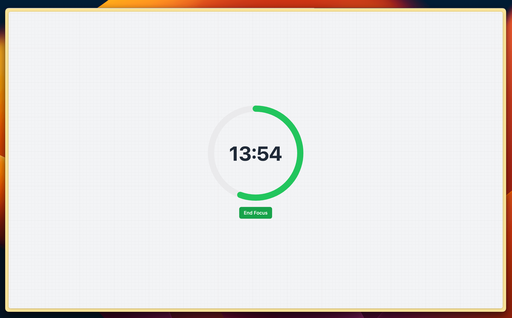

# Timematter

Timematter is completely free to use and can be easily embedded in popular note-taking software such as **Notion** and **Logseq**. With just one click, you can start your Pomodoro timer and have Lofi music playing in the background.

Timematter is perfect for anyone looking to increase their productivity and focus, whether you're a student, a professional or just someone looking to improve their time management skills. With this, you can easily stay on task and get more done in less time.

Give it a try today and see the difference for yourself!

